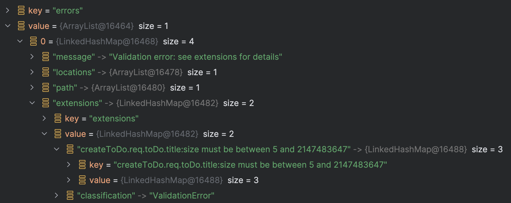

> [!IMPORTANT]
> GraQL is prerelease, experimental, and a demonstration piece. Use at your own risk.

# Input Validation

Input validation is turned on by default and "just works" via
the provided `GraQLValidationExceptionHandler` that listens for `ConstraintViolationException`s.

There's nothing you need to do!

## Example

Given a class with standard annotations:

```kotlin
data class ToDoDTO(
    @field:Size(min = 5) val title: String,
    @field:Size(min = 5) val author:String,
    val dueDate:LocalDateTime
)
```

Passing an invalid `ToDo` will invoke the `GraQLValidationExceptionHandler`, resulting in validation
failures being passed along as part of the GraphQL `errors` response:



## Customization

If you'd like to change how validation errors are handled, replace the `GraQLValidationExceptionHandler`
singleton and provide a `@GraQLExceptionHandler`-annotated method to handle the standard
`ConstraintViolationException` used by micronaut.
