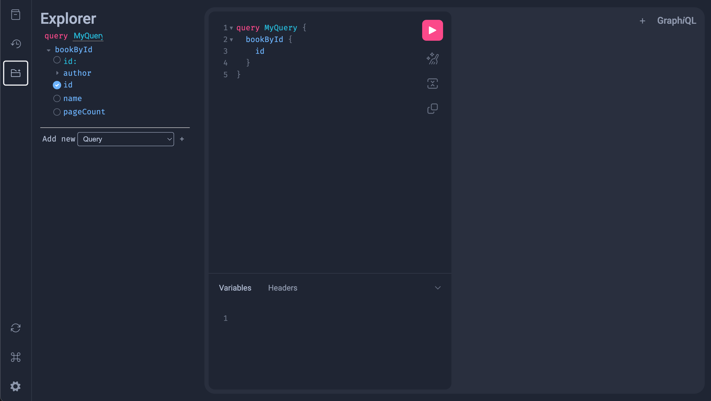

> [!IMPORTANT]
> GraQL is prerelease, experimental, and a demonstration piece. Use at your own risk.

# Getting Started

In this guide we'll walk from "empty directory" to "running application with a GraphQL browser
and the solution for a few real-world hurdles."

## Installation

GraQL is not yet available via a Gradle/Maven dependency (see above: it's prerelease and experimental!).

To get started, you'll need to clone its GitHub repository and add it as a dependency. This will 
transitively include both [graphql-java](https://www.graphql-java.com/) and the 
[micronaut GraphQL Integration](https://micronaut-projects.github.io/micronaut-graphql/latest/guide/index.html) 
tooling.

If you're starting from scratch, use [micronaut launch](https://micronaut.io/launch/) to create a 
micronaut application like any  other. Be sure to add the `graphql` feature!

### Existing micronaut Applications

Add the `micronaut-graphql` dependency to your project's `build.gradle`:

```groovy
implementation("io.micronaut.graphql:micronaut-graphql")
```


## Create A Schema

Following GraphQL best practices, GraQL encourages _schema-first_ design of your API. Create
a schema file in `src/main/resources/schema.graphqls`. The following example builds on the micronaut
to-do guide, adding:

1. GraQL's built in support for a DateTime scalar 
2. GraQL's built-in federated schema support
3. Common GraphQL best practices like single-input mutations

```graphql
scalar DateTime

type Query {
    toDos: [ToDo!]! # <1>
}
type Mutation {
    createToDo(input: CreateToDoRequest!): CreateToDoResponse 
    completeToDo(input: CompleteToDoRequest!): CompleteToDoResponse!
}
input CreateToDoRequest {
    toDo: ToDoDTO
}
input ToDoDTO {
    title: String!
    author: String!
    dueDate: DateTime!
}
type CreateToDoResponse {
    id: ID!
    authorId: ID!
}

input CompleteToDoRequest {
    id: ID!
}
type CompleteToDoResponse {
    id: ID!
    completed: Boolean!
}


type ToDo @key(fields: "id") {
    id: ID!
    title: String!
    completed: Boolean!
    dateCompleted: DateTime
    author: Author!
}

type Author { # <5>
    id: ID!
    username: String!
}

```

> [!TIP]
> You can change the location of your schema file and include multiple schema files by
> adding a list of classpath locations within your `application.yaml` file as `graql.schema-locations`


## Implement Your API

With a schema in place, it's time to implement your API! Aligning with GraphQL best practices, we recommend
designing, building, and implementing a service tier _separate from any GraphQL concerns_. 

In other words, you should build your services and domain models without depending on GraphQL or GraQL
and treat them both as a controller/endpoint layer.

With services and models written, GraQL allows you to add a controller-tier component that accepts
inbound GraphQL requests, handling any GraphQL-specific concerns before delegating to a service tier:

```kotlin
@GraQLComponent
class BookController(
    private val bookService: BookService,
    private val authorService: BookService,
) {

    /*
    Register a Query with @GraQL, defaulting to the method name as 
    the name of the GraphQL dataFetcher.
    */
    @GraQLQuery
    fun books(request: FindBooksRequest?): Collection<Book> {
        /* Any typical format-specific controller-tier stuff here! */
        /* ...stuff... */

        /* Ok, delegate to a service */
        return bookService.findBooks(request ?: FindToDosRequest())
    }

    /*
    Register a Mutation with @GraQL, defaulting to the method name as 
    the name of the GraphQL dataFetcher.
    */
    @GraQLMutation
    fun createBook(request: CreateBookRequest): CreateBookResponse {
        return bookService.createBook(request)
    }
}
```

## Test Your API

### With Code

The underlying micronaut GraphQL extension provides a `/graphql` endpoint within your application. By 
posting GraphQL queries, you can test your API from `kotest`, `JUnit`, or any other test framework.

### Visually

Starting your application with `./gradlew run`, you can browse to `http://localhost:8080/graphiql` to 
launch the GraphiQL query editor that's bundled with micronaut GraphQL integration. 

Within its editor you can test all of your operations interactively:


